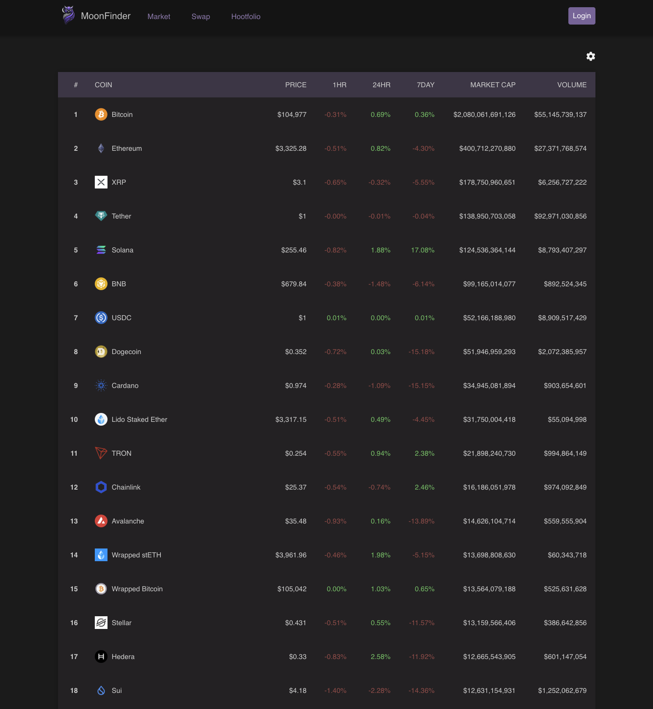
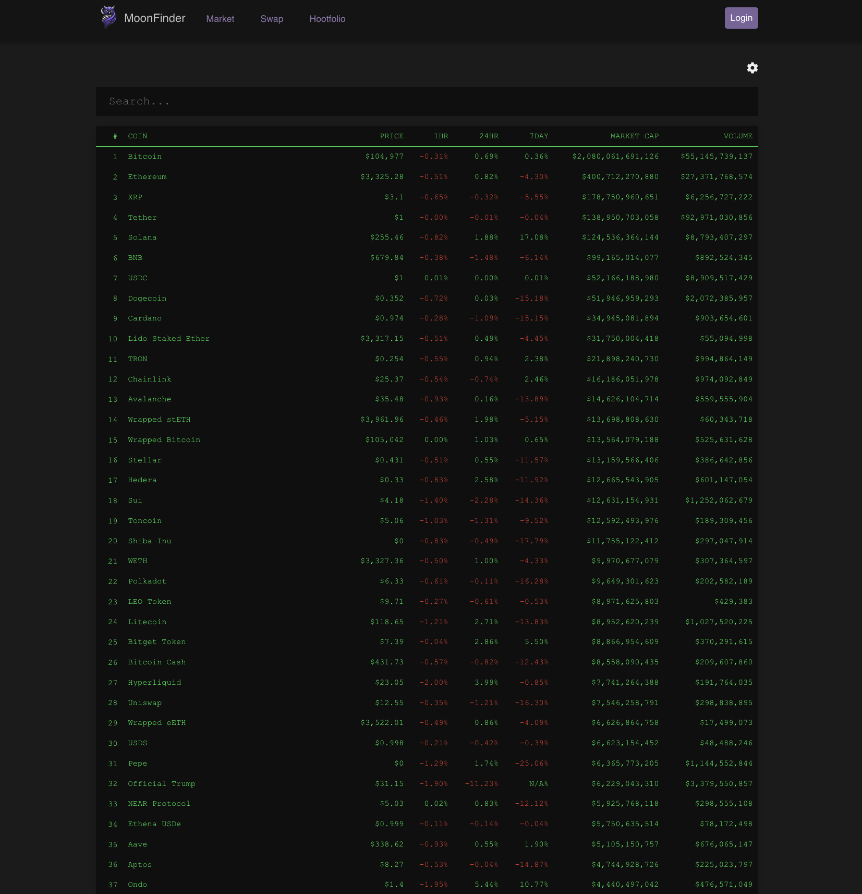
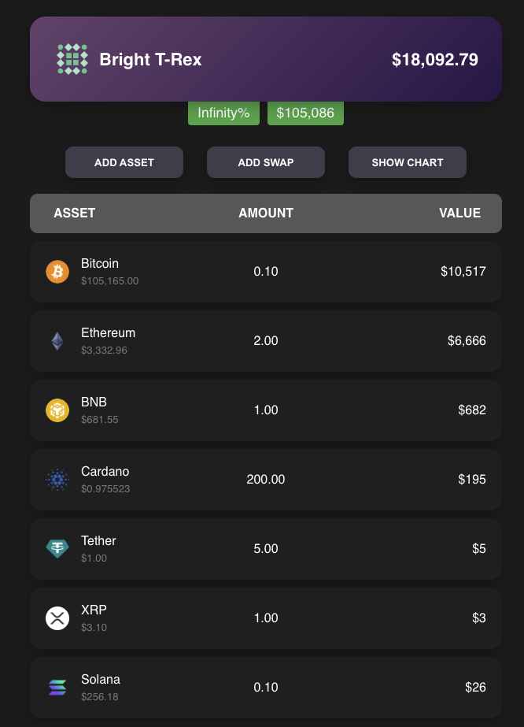
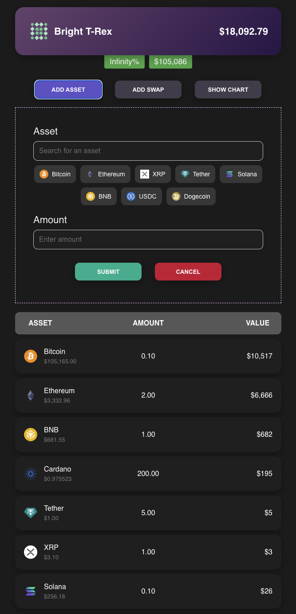
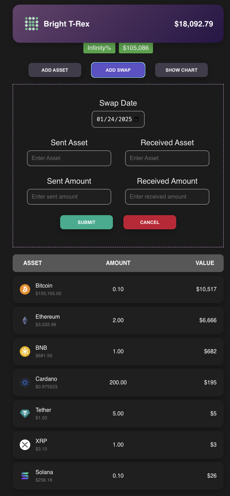
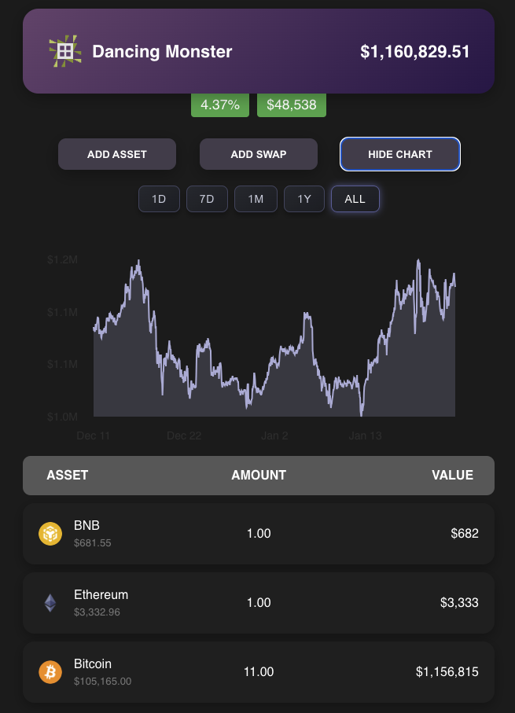
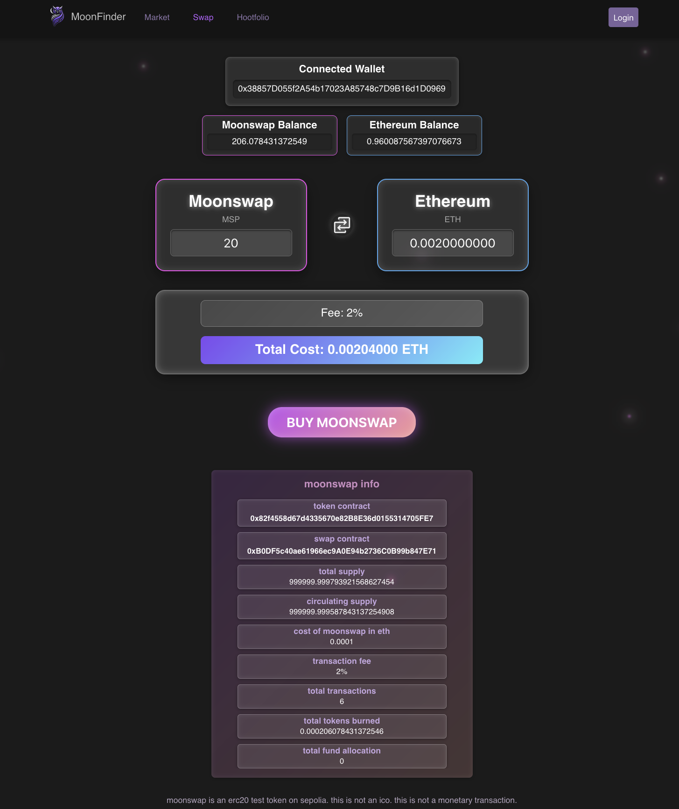

<h1 style="text-align: center;">
  
  MoonFinder
</h1>

  MoonFinder is a digital asset tracking platform

**[www.moonfinder.org](https://www.moonfinder.org)**

## **Features**

### **📈 Market Tracking**

- **Real-time updates**: Stay on top of current prices, volume, and market cap.
- **Customizable views**: Three unique `.css` styles for displaying market data.

  
  
  

### **📊 Hootfolio**

- **Portfolio management**: Monitor your digital asset portfolio in real-time.
- **Valuation insights**: View asset breakdowns and calculate your total portfolio value.
- **Add Assets or Swaps**: Dynamically add new assets or swaps to the hootfolio.
- **Hootfolio Customization**: Automated hootfolio name and icon generation. Editable hootfolio naming.

  
  
  
  

### **🤖 AI/ML Algorithm Testing** _(Coming Soon)_

- Backtest trading strategies using **AI/ML algorithms** on historical and live data.
- Analyze performance metrics to refine your trading tactics.

### **🔄 Swap Platform**

- Swap between Ethereum (ETH) and the MoonSwap token.
- Fully deployed and tested on the Sepolia testnet.
- Integrates with Metamask API and wallet services to handle swap functionality on the moonswap smart contract.
- Wrote and deployed the moonswap token and moonswap swap smart contract.

  

### **🔐 Wallet Integration** _(Coming Soon)_

- **Ethereum wallet integration** for real-time balance and transaction tracking.
- **User-friendly transfers**: Decentralized asset transfers using recipient usernames.

---

## **Technology Stack**

### **Frontend**

- **React** / **JavaScript**
- **CSS**

### **Backend**

- **Node.js** (Express)
- **Python**: Advanced NLP and blockchain interactions.

### **Blockchain**

- **Ethereum**: ERC-20 token and Sepolia testnet integration.
- **Solidity**: Smart contract implementation for seamless swaps.

### **Database**

- **PostgreSQL**

### **AI/ML Frameworks**

- **TensorFlow / PyTorch**
- **spaCy**: NLP-powered language processing

---

## **Roadmap**

### Planned Features:

- **Advanced AI/ML tools**: Automated trading and market prediction models.
- **Multi-asset wallet support**: Manage multiple assets seamlessly.
- **Mobile app**: Access MoonFinder on the go with a dedicated mobile application.

---

## **License**

MoonFinder is open-source and licensed under the [MIT License](LICENSE).
